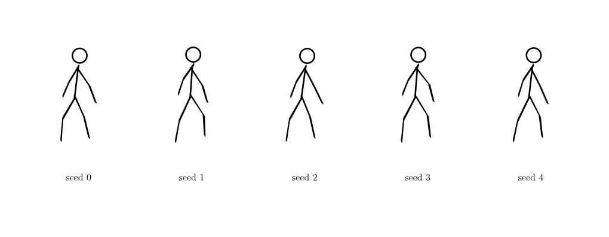
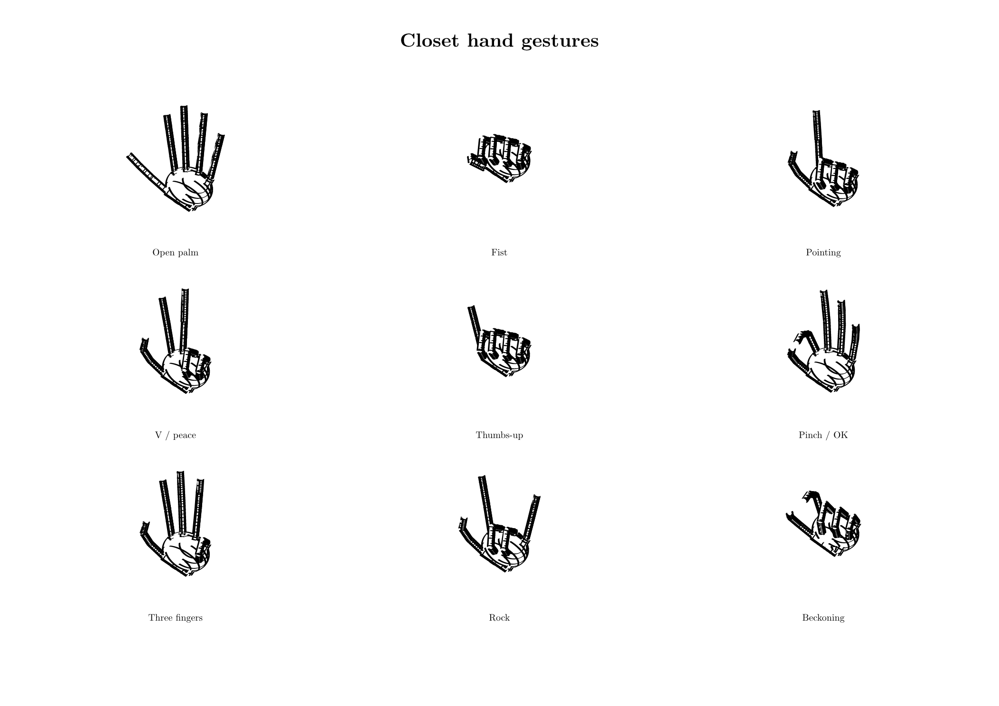
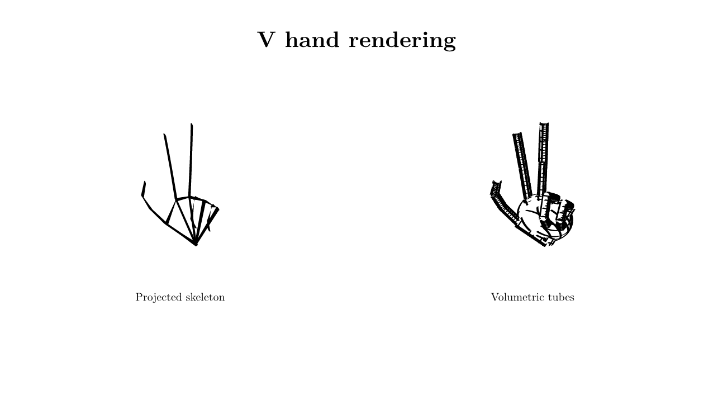

# Closet

`closet` is a small Typst package for drawing articulated human figures. It
builds joints in 3D, projects them through a configurable perspective camera,
then renders the projected bones with Premetadated's calligraphic pen engine.


```typ
#import "lib.typ": camera, human

#let view = camera(
  eye: (3.0, -8.0, 2.5),
  target: (0.0, 0.0, 0.2),
  focal-length: 7.0,
)
#human(pose: "yoga-warrior-two", scale: 1.2, camera: view)
```

For local package installation, place this directory and the sibling
`premetadated` repository at:

```text
{data-dir}/typst/packages/local/closet/0.1.0
{data-dir}/typst/packages/local/premetadated/0.1.0
```

Then import Closet with:

```typ
#import "@local/closet:0.1.0": human
```

On macOS, `{data-dir}` is `~/Library/Application Support`.

## Built-in poses

- `standing`
- `sitting`
- `sitting-cross-legged`
- `sitting-thinking`
- `walking`
- `running`
- `yoga-downward-dog`
- `yoga-child-pose`
- `yoga-warrior-one`
- `yoga-warrior-two`
- `yoga-tree`
- `squatting`
- `push-up`
- `pull-up`
- `walking-on-hands`
- `jumping-one-foot`
- `jumping-open-legs`

Compile the complete gallery with:

```sh
typst compile --root . examples/poses.typ build/poses.pdf
```

The [compiled manual](manual.pdf) includes three camera views of one unchanged
3D pose, pose variation guidance, and the complete API reference. Rebuild it
from `manual.typ` with Premetadated available in the local package path:

```sh
typst compile manual.typ build/manual.pdf
```

## Camera views

The pose is three-dimensional and independent of the camera. These are three
projections of the same `sitting-cross-legged` pose dictionary:


See `examples/camera-views.typ` for the camera definitions and `manual.typ` for
the projection model, viewpoint guidance, and complete API reference.

## API

```typ
#human(
  pose: "running", // built-in name or a 3D pose dictionary
  variation: 0.0,
  seed: 0,
  scale: 1.0,
  stroke: black,
  pen: none, // Premetadated pen; none uses the calligraphic default
  limits: none,
  camera: default-camera,
)
```

## Pose variations

Use `variation` and an integer `seed` to create related but non-identical
figures. Seeds are deterministic, making document builds reproducible:



```typ
#for seed in range(5) {
  human(pose: "walking", variation: 0.09, seed: seed)
}
```

For reuse or further editing, generate the pose dictionary first:

```typ
#let walker = vary-pose("walking", variation: 0.09, seed: 3)
#human(pose: walker)
```

`variation` ranges from `0` to `0.35`; values around `0.04` to `0.12` are best
for natural scene variation. The function perturbs normalized 3D directions,
so anatomical segment lengths remain unchanged. The complete strip is generated
by `examples/variations.typ`.

## Custom poses and gestures

Build a pose directly with `pose(...)`; omitted directions retain the standing
defaults. Gesture helpers take a built-in name or pose dictionary and return a
new dictionary, so they compose:

```typ
#import "lib.typ": bend-torso, human, stretch-arms, tilt-head, walk-legs, wave-arms

#let greeting = tilt-head(
  wave-arms(
    stretch-arms(
      bend-torso(walk-legs("standing", amount: 0.45), amount: 0.12),
      amount: 0.5,
      side: "right",
    ),
    amount: 0.85,
    side: "right",
  ),
  amount: -0.18,
)
#human(pose: greeting)
```

The available modifiers are `tilt-head`, `bend-torso`, `raise-arms`,
`stretch-arms`, `spread-legs`, `walk-legs`, and `wave-arms`. See
`examples/gestures.typ` and the compiled manual for direct construction,
parameter ranges, and side selection.

## Hand gestures

Closet also provides a procedural 3D hand based on the standard 21-landmark
topology. Canonical gestures are compact finger controls rather than stored
drawings, and use the same camera and calligraphic renderer as full figures:



```typ
#import "lib.typ": camera, hand

#hand(
  gesture: "peace",
  handedness: "right",
  tube-radius: 0.05,
  variation: 0.06,
  seed: 4,
  camera: camera(
    eye: (2.4, -7.0, 3.0),
    target: (0.0, 0.0, 0.65),
    focal-length: 6.5,
  ),
)
```

Built-ins are `open-palm`, `fist`, `pointing`, `peace`, `thumbs-up`, `pinch`
(`ok` is an alias), `three-fingers`, `rock`, and `beckoning`. Use
`hand-pose(...)` for custom finger curl, spread, thumb opposition, and wrist
orientation. `hand-angles(...)` exposes constrained joint angles;
`hand-joints(...)` returns all 21 landmarks; and `vary-hand(...)` creates
deterministic correlated variation. The default `render: "tube"` passes the 3D
chains through Premetadated's hidden-line renderer as finger tubes, thicker
metacarpal tubes, and an oblate palm ellipsoid. Use `render: "skeleton"` to
inspect projected landmark centerlines. The solids retain seams until union is
available at the Larnt level. Sparse line hatching adds depth without the cost
of stippling; set `shading: false` for outlines only. See
`examples/hand-tubes.typ` for a side-by-side comparison.



Pose vectors use `(x, y, z)`, where `x` is image-right in a front-facing pose,
`y` is depth, and `z` is up. Each upper and lower limb segment has an independent
3D direction. `poses` exposes the canonical dictionaries, while `joints(pose)`
returns their 3D joint positions.

`camera(eye:, target:, up:, focal-length:)` creates a look-at perspective
camera. `front-camera`, `profile-camera`, and `three-quarter-camera` are supplied
as convenient starting points. `project(point, camera:)` exposes the same 3D to
2D projection used by `human`.

The default pen is tangent-following calligraphy with a broad axis of `0.050`
and fine axis of `0.015`, scaled with the figure. Pass any pen accepted by
`premetadated.stroke.nib-stroke` to `human(pen:)` to control its nib.

`pose-from-degrees(base, values)` converts the sagittal numeric angles produced
by the OpenSim importer into 3D leg directions. `constrain-pose(pose, limits)`
clamps those imported lower-body coordinates.

## OpenSim development data

`tools/import_opensim.py` is an offline development tool. It downloads a pinned
revision of the official Gait2354 model and sample inverse-kinematics walk, then
maps sagittal hip and knee coordinates into this package's 3D direction model:

```sh
python3 tools/import_opensim.py
typst compile --root . examples/opensim.typ build/opensim.pdf
```

The generated `data/gait2354.json` contains model ranges and two observed gait
frames. Hip and knee coordinates in each frame come from the same instant;
sampling each joint independently within its range would not preserve a
plausible configuration.

Gait2354 sets `clamped=false`, so its ranges are model coordinate domains rather
than physiological safety guarantees. The package runtime does not parse
`.osim` or `.mot`: large source formats remain in the Python preprocessing step.
Rust/WASM is unnecessary for the current rendering workload.

See `ACKNOWLEDGMENTS.md` for rendering dependencies, source-data provenance,
and licensing details.