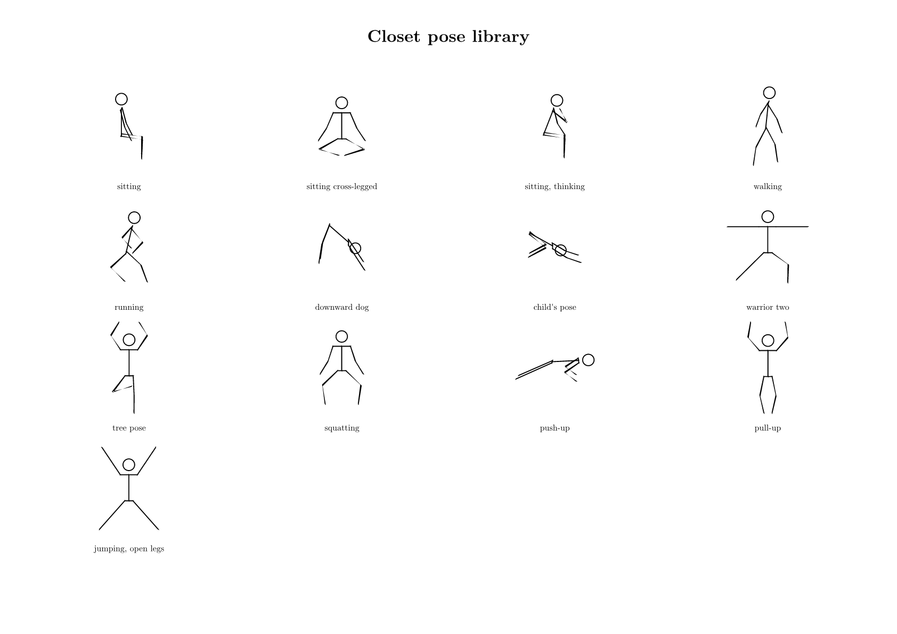
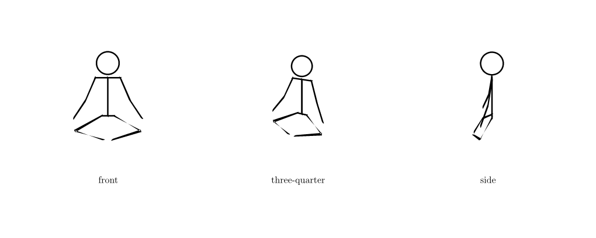

# Closet

`closet` is a small Typst package for drawing articulated human figures. It
builds joints in 3D, projects them through a configurable perspective camera,
then renders the projected bones with Premetadated's calligraphic pen engine.



```typ
#import "lib.typ": camera, human

#let view = camera(
  eye: (3.0, -8.0, 2.5),
  target: (0.0, 0.0, 0.2),
  focal-length: 7.0,
)
#human(pose: "yoga-warrior-two", scale: 1.2, camera: view)
```

For local package installation, place this directory and the sibling
`premetadated` repository at:

```text
{data-dir}/typst/packages/local/closet/0.1.0
{data-dir}/typst/packages/local/premetadated/0.1.0
```

Then import Closet with:

```typ
#import "@local/closet:0.1.0": human
```

On macOS, `{data-dir}` is `~/Library/Application Support`.

## Built-in poses

- `standing`
- `sitting`
- `sitting-cross-legged`
- `sitting-thinking`
- `walking`
- `running`
- `yoga-downward-dog`
- `yoga-child-pose`
- `yoga-warrior-two`
- `yoga-tree`
- `squatting`
- `push-up`
- `pull-up`
- `jumping-open-legs`

Compile the complete gallery with:

```sh
typst compile --root . examples/poses.typ build/poses.pdf
```

The detailed guide, including three camera views of one unchanged 3D pose, is
in `manual.typ`. Compile it with:

```sh
typst compile manual.typ build/manual.pdf
```

## Camera views

The pose is three-dimensional and independent of the camera. These are three
projections of the same `sitting-cross-legged` pose dictionary:



See `examples/camera-views.typ` for the camera definitions and `manual.typ` for
the projection model, viewpoint guidance, and complete API reference.

## API

```typ
#human(
  pose: "running", // built-in name or a 3D pose dictionary
  scale: 1.0,
  stroke: black,
  pen: none, // Premetadated pen; none uses the calligraphic default
  limits: none,
  camera: default-camera,
)
```

Pose vectors use `(x, y, z)`, where `x` is image-right in a front-facing pose,
`y` is depth, and `z` is up. Each upper and lower limb segment has an independent
3D direction. `poses` exposes the canonical dictionaries, while `joints(pose)`
returns their 3D joint positions.

`camera(eye:, target:, up:, focal-length:)` creates a look-at perspective
camera. `front-camera`, `profile-camera`, and `three-quarter-camera` are supplied
as convenient starting points. `project(point, camera:)` exposes the same 3D to
2D projection used by `human`.

The default pen is tangent-following calligraphy with a broad axis of `0.038`
and fine axis of `0.011`, scaled with the figure. Pass any pen accepted by
`premetadated.stroke.nib-stroke` to `human(pen:)` to control its nib.

`pose-from-degrees(base, values)` converts the sagittal numeric angles produced
by the OpenSim importer into 3D leg directions. `constrain-pose(pose, limits)`
clamps those imported lower-body coordinates.

## OpenSim development data

`tools/import_opensim.py` is an offline development tool. It downloads a pinned
revision of the official Gait2354 model and sample inverse-kinematics walk, then
maps sagittal hip and knee coordinates into this package's 3D direction model:

```sh
python3 tools/import_opensim.py
typst compile --root . examples/opensim.typ build/opensim.pdf
```

The generated `data/gait2354.json` contains model ranges and two observed gait
frames. Hip and knee coordinates in each frame come from the same instant;
sampling each joint independently within its range would not preserve a
plausible configuration.

Gait2354 sets `clamped=false`, so its ranges are model coordinate domains rather
than physiological safety guarantees. The package runtime does not parse
`.osim` or `.mot`: large source formats remain in the Python preprocessing step.
Rust/WASM is unnecessary for the current rendering workload.

See `ACKNOWLEDGMENTS.md` for rendering dependencies, source-data provenance,
and licensing details.